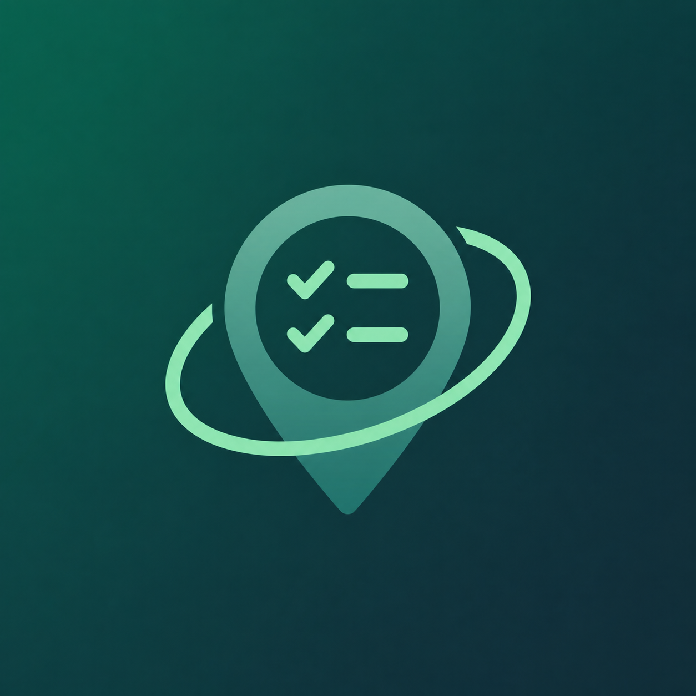

<p align="center">
  
</p>

<h1 align="center">NearBuy</h1>

<p align="center">
  Location-aware shopping lists with private, on-device storage and proximity reminders.
</p>

## Features

- Create multiple shopping lists with quantities, notes and drag-and-drop ordering
- Link a list to a store by searching for an address or selecting a point on the map
- View saved stores, markers and reminder radii on an interactive OpenStreetMap map
- Receive native proximity reminders when entering a saved store area
- Use a focused shopping mode with progress, elapsed time and haptic feedback
- Review completed shopping sessions and clear history at any time
- Choose light, dark or system theme
- Keep all lists, stores, preferences and history in a local SQLite database

## Tech stack

- Flutter and Dart
- Riverpod for application state
- Drift/SQLite for local persistence
- `flutter_map` with OpenStreetMap tiles
- Native Android and iOS geofencing
- Local notifications

## Requirements

- Flutter 3.41 or newer
- Android SDK 35 or newer
- Android 7.0 (API 24) or newer
- Xcode and macOS for iOS builds
- iOS 14 or newer

No Google Maps API key, Google Cloud project or billing account is required. An internet connection is needed to load map tiles and search for addresses.

## Getting started

Clone the repository, then run:

```bash
flutter pub get
dart run build_runner build --delete-conflicting-outputs
flutter run
```

The generated Drift database code is committed to the repository. Run the build-runner command again after changing a database table.

## Permissions

NearBuy requests only the permissions needed for its features:

- Foreground location to show the current position and choose nearby stores
- Background or always-on location for proximity reminders
- Notifications to display reminder alerts

For reliable reminders, first allow location while using the app and then enable background or always-on access in the device settings. Android 13 and newer also require notification permission.

## Build

Create a development APK:

```bash
flutter build apk --debug
```

For a signed Android release, copy `android/key.properties.example` to `android/key.properties`, provide the four local signing values and run:

```bash
flutter build appbundle --release
```

`android/key.properties` and signing keys are excluded from version control. If no release key is configured, local release builds use the Android debug certificate and are not suitable for app-store distribution.

## Verification

```bash
flutter analyze
flutter test
```

## Privacy

NearBuy has no account system, analytics service or application server. Shopping data and saved coordinates stay in the app's local database. Map tiles and address-search requests are handled by their respective map services; saved locations are not uploaded by NearBuy.

Proximity reminders depend on operating-system location services, granted permissions, battery policy and a real geofence transition.
